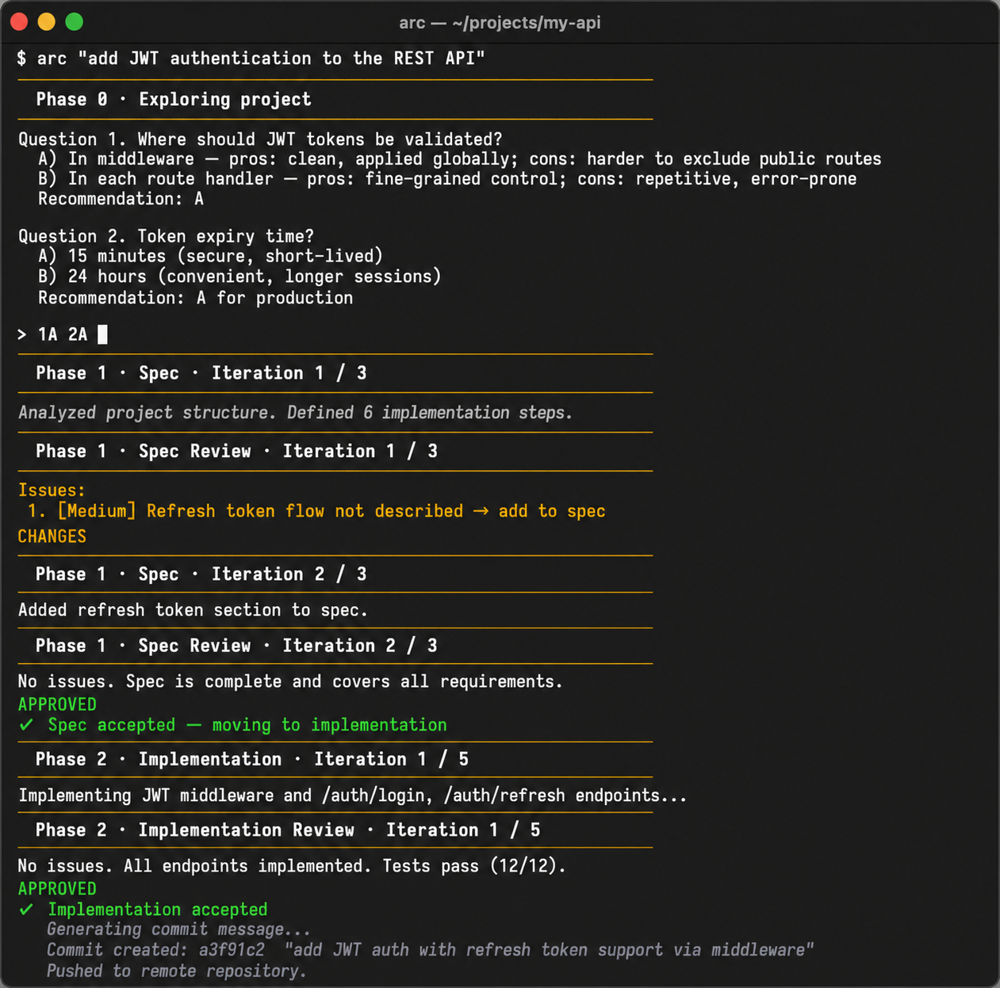

# arc

Download repository: [llm-agentic-review-cycle-main.zip](https://github.com/idoziru/llm-agentic-review-cycle/archive/refs/heads/main.zip)

CLI for loop engineering. Run it from your project root to execute a two-phase agentic loop: first the **developer** explores the project and agrees on a spec, then implements it under **reviewer** supervision. All communication happens in the language of the task.

The orchestrator is written in pure Python (stdlib, no third-party dependencies). Agents are `claude`, `codex`, `mimo`, and/or `agy` CLIs.



## Requirements

- Python 3.8+
- macOS / Linux / Windows
- At least one CLI provider (see section below)

## Installing the `arc` command

Assets (`prompts/`, `models.md`) must be located next to the `arc` script — a symlink/alias accounts for this.

### macOS / Linux

1. Go to the root of the unpacked repository and make the script executable:
   ```bash
   chmod +x arc
   ```
2. Create a symlink in a directory on your `PATH`. If `/usr/local/bin` is available:
   ```bash
   ln -sf "$PWD/arc" /usr/local/bin/arc
   ```
   If `sudo` is required — use a user-local directory:
   ```bash
   mkdir -p ~/.local/bin
   ln -sf "$PWD/arc" ~/.local/bin/arc
   # Add to ~/.zshrc or ~/.bashrc if the directory is not yet on PATH:
   echo 'export PATH="$HOME/.local/bin:$PATH"' >> ~/.zshrc && source ~/.zshrc
   ```
3. Verify the installation:
   ```bash
   arc --help
   ```

### Windows

1. Make sure Python 3.8+ is installed and available on `PATH`:
   ```cmd
   python --version
   ```
2. Create an `arc.bat` file in any directory on your `PATH` (e.g. `C:\Users\<name>\AppData\Local\Microsoft\WindowsApps\`):
   ```bat
   @echo off
   python "C:\full\path\to\llm-agentic-review-cycle\arc" %*
   ```
   Replace the path with the actual location of the repository folder.
3. Verify the installation in a new terminal window:
   ```cmd
   arc --help
   ```

## Connecting providers

At least one CLI provider must be installed and configured. New agentic CLI tools appear constantly and their installation steps change frequently — the most reliable way to get up-to-date instructions is to search for the provider name followed by "cli install", e.g.:

- `claude cli how to install`
- `codex cli how to install`
- `mimo code how to install`
- `antigravity agy cli how to install`

Once installed, add the provider's models to [`models.md`](models.md) if they aren't there yet (see [Managing the model list](#managing-the-model-list) below).

## Model check (`arc --test`)

After installing providers, verify that models respond correctly:
```bash
arc --test
```
The tool displays a list of models; you select the ones you want, it sends a test request, and prints the result.

## Usage

Go to the root of your project and run:
```bash
arc "task description" [--spec-cycles N] [--impl-cycles N]
```

- `task description` — what needs to be done (required).
- `--spec-cycles N` — max spec iterations (default: 3).
- `--impl-cycles N` — max implementation iterations (default: 5).

Agents respond in the same language as the task: an English task gets English output, a Russian task gets Russian output.

Example:
```bash
cd ~/projects/my-app
arc "add CSV export for reports" --spec-cycles 3 --impl-cycles 5
```

### How it works

1. **Phase 0**: `developer` explores the project and asks clarifying questions; you answer in the terminal.
2. **Phase 1 (spec)**: `developer` writes a spec to `_agent/spec.md`, `reviewer` issues a verdict of `APPROVED` or `CHANGES`. The cycle repeats until approved or the limit is reached.
3. **Phase 2 (implementation)**: `developer` writes code based on the approved spec, `reviewer` checks it. Same verdict logic.

When the limit is exhausted without `APPROVED`, the tool asks: continue for another N iterations or stop.

On successful completion, a git commit is created automatically with an AI-generated description and pushed.

## Additional information

### Artifacts

A `_agent/` directory is created in the target project root (recommended to add to `.gitignore`):

- `spec.md` — current spec and plan
- `answers.md` — Phase 0 answers
- `spec_review.md` / `impl_review.md` — latest reviews
- `log.md` / `log_summary.md` — iteration log and summary
- `state.json` — state for `resume`
- `.lock` — prevents concurrent runs in the same directory

On a subsequent run in a project that already has `_agent/`, the tool offers to resume, archive, or clear the previous run.

### Parallel runs

Simultaneous runs in different projects in different terminal windows are supported (up to 3). Background mode without an interactive TTY is not supported.

### Managing the model list

Available models are defined in [`models.md`](models.md) at the repository root. The orchestrator reads that file at startup and builds the selection menu from it — there are no hardcoded model IDs in the code.

**Format** — each model is one line between section markers:

```
<!-- models:<cli>:start -->

model-id | Human-readable name
another-model-id

<!-- models:<cli>:end -->
```

The human-readable name after `|` is optional. Blank lines, `#` comment lines, and lines with an ID in parentheses are ignored.

**To add a model** — paste a new line inside the appropriate `<!-- models:<cli>:start/end -->` block. Example for Claude:

```
<!-- models:claude:start -->

claude-opus-4-8
claude-sonnet-4-6
claude-haiku-4-5

<!-- models:claude:end -->
```

**To remove a model** — delete or comment out (`#`) its line.

**Finding current model IDs:**

| Provider | Command |
|---|---|
| Claude | `claude --help` (aliases: `opus`, `sonnet`, `haiku`, `fable`) |
| Codex | `codex doctor` or `grep model ~/.codex/config.toml` |
| MiMo | `mimo models` |
| Antigravity | `agy models` |

After editing `models.md`, the next `arc` run picks up the changes automatically.

### More

Full documentation is in [docs/](docs/).

## License

MIT — do whatever you want with this project: use, copy, modify, distribute, including commercially, without restriction.
